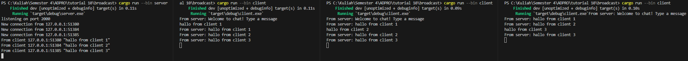

When entering a message from 3 different clients, the server will receive the message and send it to all other clients.

I modified the port 2000 to 8080 in the code at `src/bin/client.rs` and `src/bin/server.rs`

<table>
<tr>
<th>Before</th>
<th>After</th>
</tr>
<tr>
<td >

```rust
// client.rs
ClientBuilder::from_uri(Uri::from_static("ws://127.0.0.1:2000"))
    .connect()
    .await?;
    
// server.rs
let listener = TcpListener::bind("127.0.0.1:2000").await?;
```

</td>
<td>

```rust
// client.rs
ClientBuilder::from_uri(Uri::from_static("ws://127.0.0.1:8080"))
    .connect()
    .await?;

// server.rs
let listener = TcpListener::bind("127.0.0.1:8080").await?;
```

</td>
</tr>
</table>

The server listens using TCP while the client makes a connection using websocket. This can be done because the websocket protocol enables ongoing, bidirectional communication between a web client and a web server over an underlying TCP connection while TCP provides the reliable transport layer protocol.